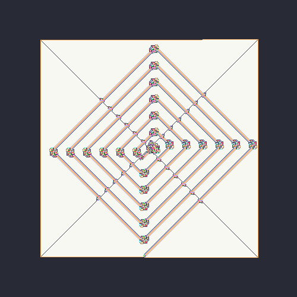

#### ./imgs

#### ./imgs/LLRRLLRR_RRLL_family

(50,50)LLRRLLRRRRLL.

(50,50)LLRRLLRRRRLLRRLL.

(50,50)LLRRLLRRRRLLRRLLRRLL.

(50,50)LLRRLLRRRRLLRRLLRRLLRRLL.

#### ./imgs/LL_R_LLfamily

(50,50)LLRLL.

(50,50)LLRRLL.

(50,50)LLRRRLL.

(50,50)LLRRRRLL.

(50,50)LLRRRRRLL.

(50,50)LLRRRRRRLL.

(50,50)LLRRRRRRRLL.

(50,50)LLRRRRRRRRLL.

#### ./imgs/LRLLL_R_LRLLfamily

(50,50)LRLLLRLRLL.

(50,50)LRLLLRRLRLL.

(50,50)LRLLLRRRLRLL.

(50,50)LRLLLRRRRLRLL.

(50,50)LRLLLRRRRRLRLL.

(50,50)LRLLLRRRRRRLRLL.

(50,50)LRLLLRRRRRRRLRLL.

(50,50)LRLLLRRRRRRRRLRLL.

#### ./imgs/LRRLLLRLRLRR_L_family

(50,50)LRRLLLRLRLRRL.

(50,50)LRRLLLRLRLRRLL.

(50,50)LRRLLLRLRLRRLLL.

(50,50)LRRLLLRLRLRRLLLL.

(50,50)LRRLLLRLRLRRLLLLL.

(50,50)LRRLLLRLRLRRLLLLLL.

#### ./imgs/L_R_LLRRLRLfamily

(50,50)LRLLRRLRL.

(50,50)LRRLLRRLRL.

(50,50)LRRRLLRRLRL.

(50,50)LRRRRLLRRLRL.

(50,50)LRRRRRLLRRLRL.

(50,50)LRRRRRRLLRRLRL.

(50,50)LRRRRRRRLLRRLRL.

(50,50)LRRRRRRRRLLRRLRL.

(50,50)LRRRRRRRRRLLRRLRL.

(50,50)LRRRRRRRRRRLLRRLRL.

#### ./imgs/L_R_LLRfamily

(50,50)LRLLR.

(50,50)LRRLLR.

(50,50)LRRRLLR.

(50,50)LRRRRLLR.

(50,50)LRRRRRLLR.

(50,50)LRRRRRRLLR.

(50,50)LRRRRRRRLLR.

(50,50)LRRRRRRRRLLR.

(50,50)LRRRRRRRRRLLR.

(50,50)LRRRRRRRRRRLLR.

#### ./imgs/L_R_Lfamily

(50,50)LRL.

(50,50)LRRL.

(50,50)LRRRL.

(50,50)LRRRRL.

(50,50)LRRRRRL.

(50,50)LRRRRRRL.

(50,50)LRRRRRRRL.

(50,50)LRRRRRRRRL.

#### ./imgs/Multiples

(10,50)LRRL(50,50)LLRRLL.

(10,50)LRRL(90,50)LRRL.

(10,50)LRRL(90,50)RLLR.

(10,50)RLLR(50,50)RLLLLRRRLLL.

(45,50)LLRLL(55,50)RRLRR.

(45,50)LLRLRLL(55,50)RRLRLRR.

(45,50)LLRRRRLL(55,50)RRLLLLRR.

(45,50)LRRRRL(55,50)RLLLLR.

(45,50)LRRRRRL(55,50)RLLLLLR.

(45,50)RLL(55,50)LRR.

(45,50)RLLLLL(55,50)LRRRRR.

(45,50)RLLLLRRRLLL(55,50)LRRRRLLLRRR.

(45,50)RLLLRRR(55,50)LRRRLLL.

(45,50)RLLLRRRL(55,50)LRRRLLLR.

(45,50)RLLLRRRLL(55,50)LRRRLLLRR.

(45,50)RLLLRRRLLL(55,50)LRRRLLLRRR.

(45,50)RLLRRR(55,50)LRRLLL.

(45,50)RLNLR(55,50)LRNRL.

(45,50)RRBRR(55,50)LLBLL.

(45,50)RRRRLLLLLLLL(55,50)LLLLRRRRRRRR.

(50,50)LRRL(50,50)RBL.

Butterfly(45,50)LLRLLRLL(55,50)RRLRRLRR.

Moth(45,50)LLRLL(55,50)RRLRR.

Penis(45,50)RRRRLLLLLL(55,50)LLLLRRRRR.

#### ./imgs/RLRL_R_LLfamily

(50,50)RLRLRLL.

(50,50)RLRLRRLL.

(50,50)RLRLRRRLL.

(50,50)RLRLRRRRLL.

(50,50)RLRLRRRRRLL.

(50,50)RLRLRRRRRRLL.

(50,50)RLRLRRRRRRRLL.

#### ./imgs/RRLLLR_L_family

(50,50)RRLLLRL.

(50,50)RRLLLRLL.

(50,50)RRLLLRLLL.

(50,50)RRLLLRLLLL.

(50,50)RRLLLRLLLLL.

(50,50)RRLLLRLLLLLL.

#### ./imgs/RRLRRRRLL_R_family

(50,50)RRLRRRRLLR.

(50,50)RRLRRRRLLRR.

(50,50)RRLRRRRLLRRR.

(50,50)RRLRRRRLLRRRR.

(50,50)RRLRRRRLLRRRRR.

(50,50)RRLRRRRLLRRRRRR.

(50,50)RRLRRRRLLRRRRRRR.

(50,50)RRLRRRRLLRRRRRRRR.

(50,50)RRLRRRRLLRRRRRRRRR.

(50,50)RRLRRRRLLRRRRRRRRRR.

(50,50)RRLRRRRLLRRRRRRRRRRR.

(50,50)RRLRRRRLLRRRRRRRRRRRR.

(50,50)RRLRRRRLLRRRRRRRRRRRRR.

#### ./imgs/RRL_L_family

(50,50)RRLL.

(50,50)RRLLL.

(50,50)RRLLLL.

(50,50)RRLLLLL.

(50,50)RRLLLLLL.

#### ./imgs/RRL_R_LLLRRRRRLLfamily

(50,50)RRLRLLLRRRRRLL.

(50,50)RRLRRLLLRRRRRLLL.

(50,50)RRLRRRLLLRRRRRLLL.

(50,50)RRLRRRRLLLRRRRRLLL.

(50,50)RRLRRRRRLLLRRRRRLLL.

(50,50)RRLRRRRRRLLLRRRRRLLL.

#### ./imgs/RRRRLLL_L_family

(50,50)RRRRLLLL.

(50,50)RRRRLLLLL.

(50,50)RRRRLLLLLL.

(50,50)RRRRLLLLLLL.

(50,50)RRRRLLLLLLLL.

(50,50)RRRRLLLLLLLLL.

(50,50)RRRRLLLLLLLLLL.

#### ./imgs/R_L_RRRLLLfamily

(50,50)RLLLLLRRRLLL.

(50,50)RLLLLRRRLLL.

(50,50)RLLLRRRLLL.

(50,50)RLLRRRLLL.

(50,50)RLRRRLLL.

#### ./imgs/Rails

(50,50)LLBRLL.

(50,50)LLBRLRBLL.

(50,50)LLRLRLLLRLLLLL.

(50,50)LLRRRLLLLRRLLRRLLRRRLLLL.

(50,50)LLRRRLLLLRRRLLL.

(50,50)LLRRRLLLRRRLLLL.

(50,50)LLRRRLLLRRRLLLLL.

(50,50)RNLLRLLLLRLLNR.

(50,50)RRLLLRLLLRRR.

(50,50)RRLRLLRRRRLL.

(50,50)RRRRLRRRRLL.

#### ./imgs/_R_BLfamily

(50,50)RBL.

(50,50)RRBL.

(50,50)RRRBL.

(50,50)RRRRBL.

(50,50)RRRRRBL.

(50,50)RRRRRRBL.

(50,50)RRRRRRRBL.

(50,50)RRRRRRRRBL.

(50,50)RRRRRRRRRBL.

(50,50)RRRRRRRRRRBL.

(50,50)RRRRRRRRRRRBL.

